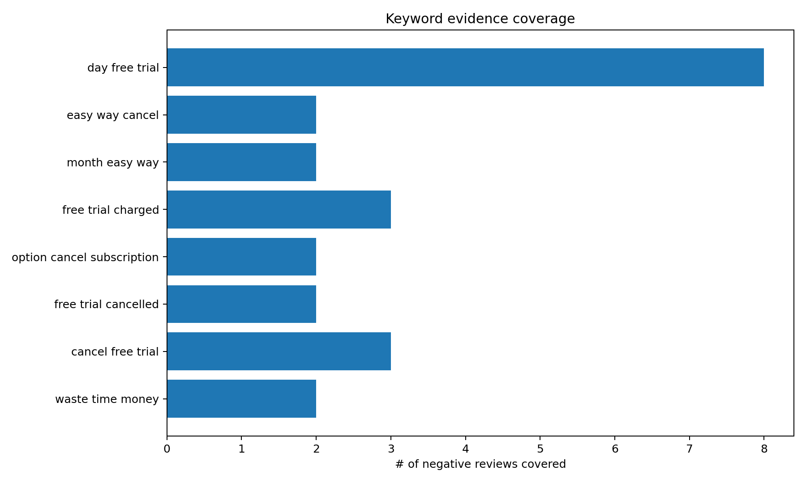
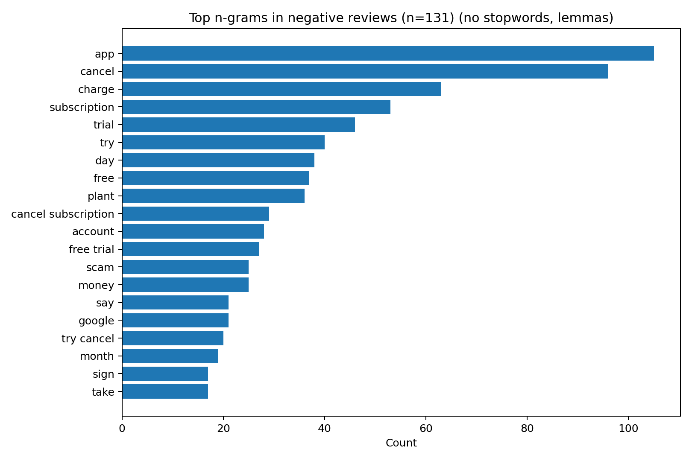
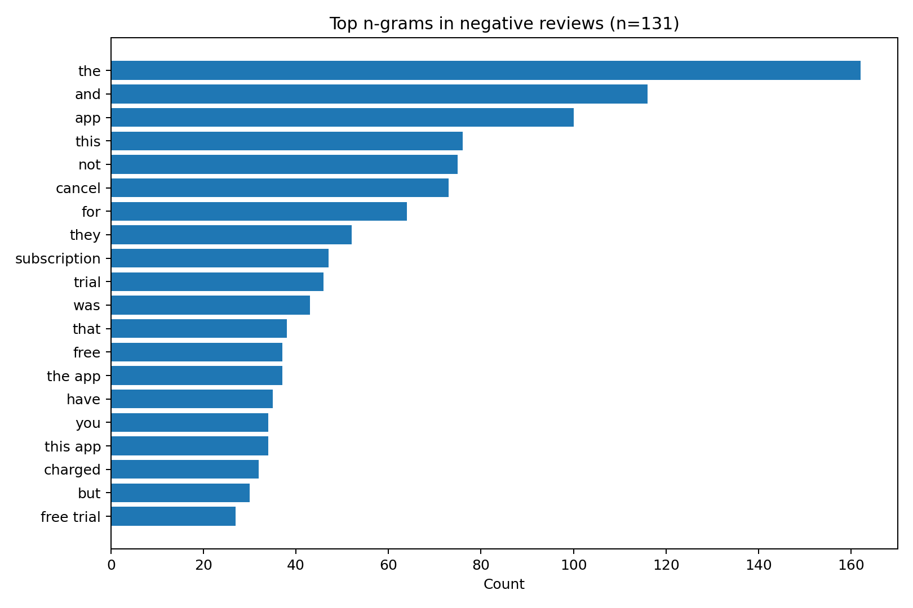
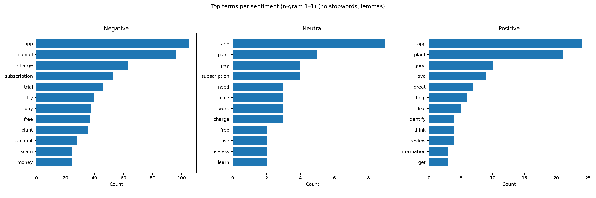
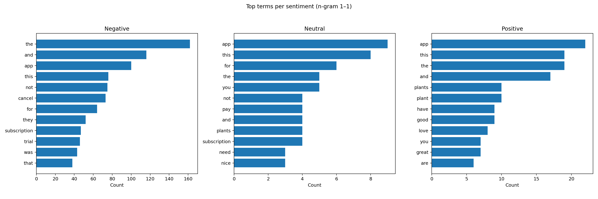

# Review Insights Report

This report summarizes key findings from the analysis of user reviews, focusing on sentiment, keyword extraction, and the influence of text preprocessing choices (stopword removal and lemmatization).

---

## 1. Keyword Evidence Coverage

**Observation:**  
The most frequent pain points are directly tied to *free trial* issues and *cancellation difficulty*. The keyword **"day free trial"** appears in the largest proportion of negative reviews, followed by other related bigrams like "free trial charged" and "cancel free trial". This indicates a strong need to address trial cancellation and billing transparency.

---

## 2. Top n-grams in Negative Reviews

### Without Stopwords & Lemmatization

### With Stopwords (Raw Text)

**Impact:**  
- Without stopwords, results focus on **actionable product terms** (e.g., *app*, *cancel*, *charge*, *subscription*, *trial*).  
- With stopwords, high-frequency but **non-informative words** (e.g., *the*, *and*, *this*) dominate.  
- Lemmatization merges word variants (*charges*, *charged* → *charge*), increasing clarity and reducing redundancy.

---

## 3. Top Terms Per Sentiment

### Without Stopwords & Lemmatization

### With Stopwords

**Impact:**  
- Removing stopwords and lemmatizing shifts the focus toward **core sentiment drivers**.  
  - **Negative:** Cancel, charge, subscription.  
  - **Positive:** App, plant, good, love.  
- With stopwords, common filler words obscure sentiment-specific signals. For example, in negative reviews, *the* and *and* are top-ranked terms, which provide little insight.

---

## Conclusions

1. **Stopword removal and lemmatization significantly improve insight quality** by filtering noise and grouping related word forms.
2. **Actionable issues** — free trial confusion, billing disputes, and cancellation friction — stand out clearly only after applying preprocessing.
3. **Recommendation:** Always run both raw and cleaned analyses during exploratory work:
   - Raw counts: Show the "true" user language, useful for UX wording adjustments.
   - Cleaned counts: Surface the real problems and product strengths.
